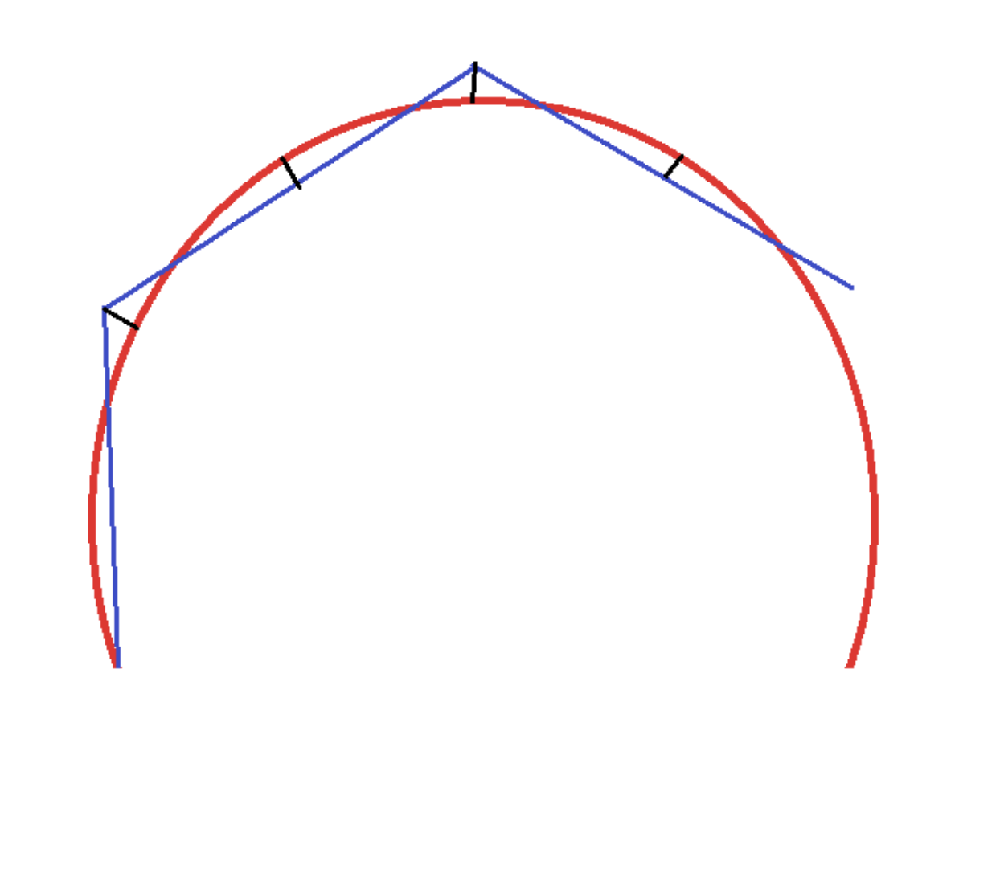

# Solution for Computational Geometry Challenge

This challenge is to implement a heavily simplified form of some 2D
boundary-representation geometry data structures and algorithms, as described [here](docs/GeometryTakeHome.md).


### How to run it

On Mac,
````
git clone https://github.com/OptimisticLock/GeometryD
cd GeometryD
open index.html
````
[Live demo here](https://optimisticlock.github.io/GeometryD/). 
               

The web UI has been tested on Chrome 86.0.4240.111 and might be glitchy in other browsers. As a matter of fact, it is glitchy, period. Here is a screenshot.

  


### Obstacles

* I am not familiar with graphic libraries, so I built a rudimentary SVG-based one. I had to teach myself SVG. And, run a refresher on high school trigonometry, which was, alas, thoroughly forgotten. 

* I tried and rejected due to the complications and the lack of time: Typescript, Node, different types of `module`s on local web page. 

* I made a mistake of massively overengineering the type hierarchy of `Edge`s. I wanted to make it possible to allow for addition of new future edge types, e.g. an `EllipticalArc` or `BezierCurve`. I guess I wanted to use this exercise to experiment and find out to what extent ES6 is suitable for moderately complex OO. Seemed like a good idea at the time, but turned into a showcase on YAGNI, and slowed me down greatly. 

* In hindsight, if I wanted to overengineer, I think it would have been much more useful to focus on making `Wire`s, not `Edge`s, as generic as possible, make it an interface using iterators (ES6 generators would work nicely for that), so that very complex wires wouldn't have to be backed by arrays. The lower the maximum deflection, the higher the storage requirements for discretized wires, the more incentive to calculate them on the fly. Although, one would need to balance that against the cost of computations on wires, e.g. calculating collisions. 

* I spent a lot of downtime trying to create the right modular structure  (`import`/`export`/`require` etc.) instead of polluting the global namespace. Turns out, web browsers aren't very fond of accessing the local file system, because CORS. I even tried to migrate to Typescript, in part because of this issue, and also because a strongly typed language is clearly called for. I abandoned both attempts.

* All in all, using Javascript for this has been an interesting experiment, but I wouldn't do it again.


## Collision detection

  The current version only detects collisions between line segments. It is however possible to fist discretize an arbitrary wire to a desired maximum linear deflection, *then* check it for collisions. Of course, the precision of collision detection in this case is a function of maximum linear deflection.
  
  The demo does exactly that: first discretizes the wire, then detects collisions. On the picture above, collisions are marked with red dots.
  
  TODO: Collinear segments aren't detected as collisions yet. 
  
  When two edges merely touch (and not necessarily cross), it's considered a collision, with the exception of two adjacent edges touching at vertices omly.  E.g., a T shape is a collision.

 The current collision detection implementation is brute force: it tests all pairs of non-adjacent edges, hence the time complexity of O(n²) and the space complexity of O(n).
 
 In the future, it should be fairly straightforward to collision-check non-discrete wires. For instance, intersection of two circular arc segments can be detected by solving a system of two equations: 
````
      (x-x1)² + (y-y1)² = r1²
      (x-x2)² + (y-y2)² = r2²
````  
 Where `(x1, y2)` and `(x2, y2)` are centers of the circular arcs, with the algorithm for finding the center already implemented at `Arc.getCenter()`
  
 The next step would be to test whether the collision points (if any) lie within both arc segments, i.e. whether `alpha0 < atan2(y, x) < alpha` for both arcs. Similar logic already exists in the code in  `Arc.discretizeInto(wire, deflection)`. 
  
Performance can be improved by implementing broad and narrow phases of collision. In the broad phase, we'd quickly rule out the edges which obviously can't collide, e.g. because of their bounding boxes not intersecting. 
  
Or, we could do another inexpensive calculation, though I am not sure it will buy us much more: Arcs aren't colliding if
````  
      (x2 - x1)² + (y2 - y1)² > (r1 + r2)²`.
```` 
  
  (TODO:look up AABB trees!)
  
  
  * More efficient algorithms exist, e.g. one for line segments described  [here](http://geomalgorithms.com/a09-_intersect-3.html#:~:text=Simple%20Polygons,-(A)%20Test%20if&text=The%20Shamos%2DHoey%20algorithm%20can,polygon%20is%20simple%20or%20not.&text=Nevertheless%2C%20there%20have%20often%20been,include%20a%20complete%20standalone%20algorithm).   I haven't had a chance to familiarize myself with them.
  
    (TODO: in this document, I use the terms "collision" and "intersection" interchangeably, but they might have a different meaning).
  

### Roadmap

* Improve collision detection as described above.

* Arcs are discretized using inscribed regular polygons. That achieves the goal, but suboptimally. The same maximum linear deflection can be achieved with fewer line segments by using regular polygons that are somewhere between inscribed and circumscribed ones. 



* I assume input needs to be heavily sanity-checked, given the nature of the business.

* Tests. Including unit tests.

* Consider turtle graphics. 
 
* Allow for arcs with an angle > 180 degrees. Currently, the only way to construct these is by creating two shorter adjacent arcs. That should be easily fixable. 
 
* Use `module`/`export`/`import`/`require`

* In a strictly typed language with operator overloading and implicit conversions, like Skala, I'd use Points, not numbers. That didn't fly so well in Javascript and was one of the things I had to undo. (Operator overloading would have come handy in so many ways!)

    **Edit** Spoke too soon. I had to depart from primitive types and go more OO in `lineGeometry.js`, it now has `Point` `Vector`, etc. Was unreadable without. Now I have to TODO: work `Point` and such back into the rest of the code, for uniformity. 

* If needed, might optimize performance by not spending so much time in trigonometric functions (caching? Controlling precision? Substituting algorithms?)

* Any discrete implementation may fail for very small and very large values, while possibly providing unnecessarily high precision (and low performance) mid-range. That may require more careful consideration: testing, limiting the input ranges, adjusting the algorithms accordingly. (I've read somewhere that there are formats superior for computational geometry to floating point, TODO will see if I can find it).

* Also, [search for TODO in code](https://github.com/OptimisticLock/GeometryD/search?q=TODO).


  
    
