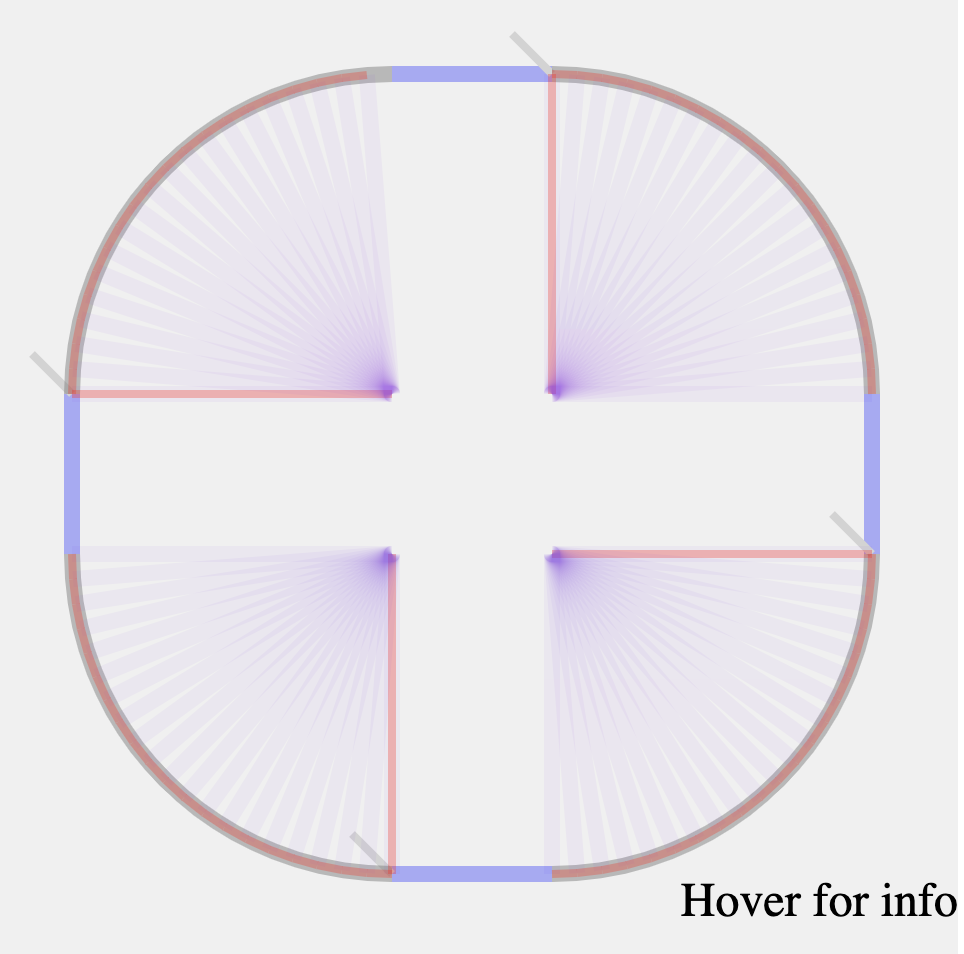

# Computational Geometry Challenge Solution

This challenge is to implement a heavily simplified form of some 2D
boundary-representation geometry data structures and algorithms, as described [here](GeometryTakeHome.md).

### Obstacles. 

1. I am not familiar with graphic libraries, so I built a rudimentary SVG-based one. I had to teach myself SVG. And run a refresher on high school trigonometry, which was, alas, completely forgotten in the beginning.

2. I tried and rejected due to the complications and the lack of time: Typescript, Node, modules on local web page (for causing CORS errors #TODO duplicate)

3. Took me some time and lots of refactoring to learn to write this type of applications in idiomatic Javascript. 

### TODO

1. The code needs major refactoring. Everything lives at the presentation layer.

2. I assume input needs to be heavily sanity-checked, given the nature of real life challenges faced by the company.

3. Assumptions regarding the input need to be verified.

 *  I am almost positive I got the concept of "fillets" right, but need to double-check.

 * All arcs are 90 degrees and start and end at 90 * n degrees angles.
 
 * Tests. Including unit tests.
 
 * I felt the nature of the company requires more defensive programming. I felt I haven't been defensive enough.

### Problems

* Normally, I'd be squashing a lot of `git commit`s. I wouldm't be checking in broken code, definitely not into the main branch.

* Need to use `const` a lot more

* use the arrow `=>` syntax

* Use `module`/`export`/`import`/`require`, instead of polluting global namespace. I found that in a local browser, that causes CORS issues requiring further attention.

* Use TypeScript. I actually tried and loved how it worked in Node, but then rolled it back because of the compilation issues involving modules in the local browser (see above) and finding myself spending a lot of time in `tsconfig.json`. 

### Tradeoffs

* When designing a new app, especially a greenfield project, there can be a bit of a tradeoff between the YAGNI principle and good architecture. Where "good architecture" is defined as anticipating the possible directions of change and making them easier to implement in the future.

    In my design, I made a wild bet that lines and circular arcs won't be sufficient long term, and more edge types, e.g. elliptic curves, will be needed. I made some adjustments for that, avoiding hard-coding "Line" and "Arc" throughout the code and instead instantiating lines and arcs dynamically. In retrospect, that *was* overengineering and a major YAGNI violation, I don't even know if my bet is accurate, and it probably wasn't a good idea. (I guess I did it because I was on my own time and I wanted to experiment and see if it's feasible to do reasonably complex OO in ES6).
    
 Edit: That was a mistake. I really didn't need it, and the cost  of the experiment turned much higher than anticipated. 
    

### Latest SVG renderer snapshot

This is the latest snapshot of the  renderer [svg/render.html](svg/render.html).
.

It calculates arc centers and  angles correctly, and approximates arcs with chords with a given maxium deflection. Does that suboptimally though, by using insribed polygons.

