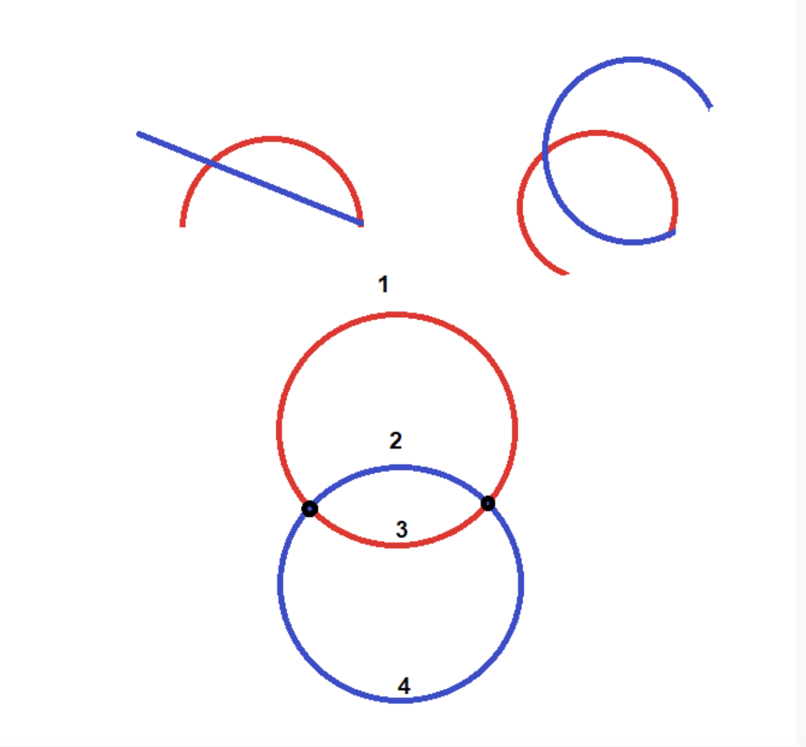
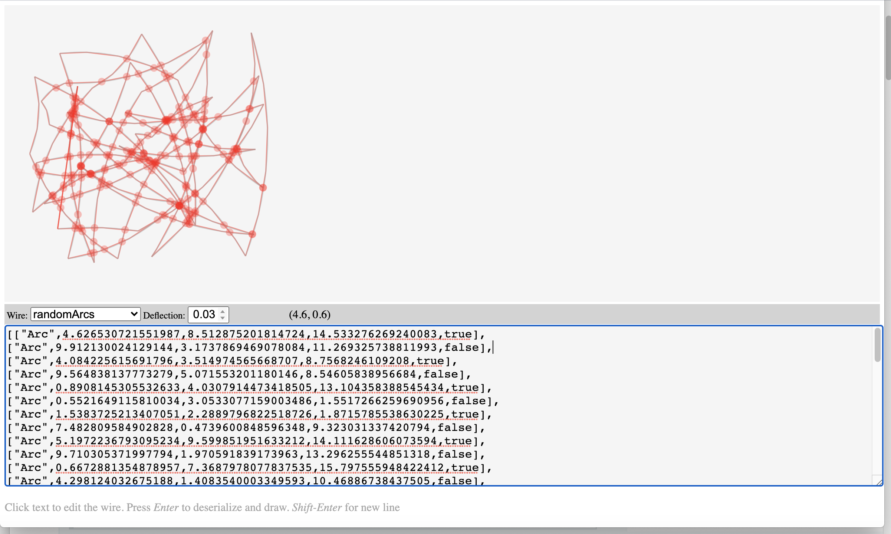

# Computational Geometry Challenge Solution

This challenge is to implement a heavily simplified form of some 2D
boundary-representation geometry data structures and algorithms, as described [here](docs/GeometryTakeHome.md).

The solution has a web UI, found at [svg/render.html](svg/render.html), with a live demo at https://optimisticlock.github.io/geometry/svg/render.html  

The WebUI has only been tested on Chrome 86.0.4240.111 and might be glitchy in other browsers. As a matter of fact, it has a couple of smallish bugs on Chrome, too.

### Obstacles

* I am not familiar with graphic libraries, so I built a rudimentary SVG-based one. I had to teach myself SVG. And run a refresher on high school trigonometry, which was, alas, thoroughly forgotten.

* I tried and rejected due to the complications and the lack of time: Typescript, Node, modules on local web page. 

* I made a mistake of massively overengineering the type hierarchy of Edges. I wanted to make it possible to allow for addition of new future edge types, e.g. an EllipticalArc or BezierCurve. I guess I wanted to use this exercise to experiment and find out to what extent ES6 is suitable for moderately complex OO. Seemed like a good idea at the time, but turned into a showcase on YAGNI, and slowed me down greatly. 

* In hindsight, if I wanted to overengineer, I think it would have been much more useful to focus on making Wires, not Edges, as generic as possible, make it an interface using iterators (ES6 generators would work for that), so that very complex wires don't have to be backed by arrays. The lower the maximum deflection, the higher the storage requirements for discretized wires, unless they are calculated on the fly. Would have been a much easier change with a greater effect. But need to think how that would affect computations, e.g. calculating intersections.

* I spent a lot of downtime trying to create the right modular structure  (`import`/`export`/`require` etc.) instead of polluting the global namespace. Turns out, web browsers aren't very fond of accessing the local file system, because CORS. I even tried to migrate to Typescript, in part because of this issue, and also because a strongly typed language is clearly called for. I abandoned both attempts.

* All in all, using Javascript for this has been an interesting experiment, but I wouldn't do it again.


## Detecting intersections

  The current version still doesn't detect intersections! I should still have the time to implement that.
  
  Without having read any literature on the subject, some preliminary thoughts. 
  
  * Is it okay to assume that an edge that merely touches a non-adjacent edge, intersects it? E.g. is T-shape an intersection? That would greatly simplify the calculations. Especially it would be a nice simplification to assume that if more than two edges have the same vertex, the wire intersects.

  * Do we detect intersections on discretized wire, or the original one with arcs? The former is simpler algorithmically, if we don't need to worry about runtime efficiency. The precision of the discretized wire solution would be in the order of the maximum linear deflection. 

  * To find whether two line segments intersect, we'd need to solve a system of two linear equations and then find if the intersection point lies within both segments.
  
  * Likewise, to find whether a circular arc and a line segment intersects, we'd need to solve a system of a linear and a quadratic equations `(x²2 + y²2 = r²2 `in the translated coordinate system) and then find if the intersection point lie within both the linear segment and the arc (the latter means r `alpha0 < atan2(y, x) < alpha`,  that logic already exists in the code in  `Arc.discretizeInto(wire, deflection)`. 
  
  * Intersection of circular arcs can be solved similarly. 
````
      (x-x1)² + (y-y1)² = r1²
      (x-x2)² + (y-y2)² = r2²
````  
  Where `(x1, y2)` and `(x2, y2)` are centers of the circular arcs, with the algorithm for finding the center already implemented at `Arc.getCenter()`
  
  * A brute-force way of detecting intersections is to see whether any two non-adjacent wires intersect, with complexity of O(n²).
    
  * Two adjacent circular segments, or a circular and an adjacent line segment, can intersect, too. 
  
  
  
  Two adjacent line segments never intersect (with the possible exception of a 180 degree angle between two lines, i.e. when a line traces back)
  
  * More efficient algorithms should exist, e.g. one for line segments described  [here](http://geomalgorithms.com/a09-_intersect-3.html#:~:text=Simple%20Polygons,-(A)%20Test%20if&text=The%20Shamos%2DHoey%20algorithm%20can,polygon%20is%20simple%20or%20not.&text=Nevertheless%2C%20there%20have%20often%20been,include%20a%20complete%20standalone%20algorithm).
  


### Roadmap

* Detect intersections!!

* Arcs are discretized using inscribed regular polygons. That achieves the goal, but suboptimally. I think it should be possible to achieve the same maximum linear deflection using fewer edges by using regular polygons that are somewhere between inscribed and circumscribed ones. 

* I assume input needs to be heavily sanity-checked, given the nature of the business.

* Tests. Including unit tests.

* Consider turtle graphics. (In fact, I  might have done just that had I understood the assignment correctly in the beginning).

* Allow for arcs with an angle > 180 degrees. Currently, the only way to construct those is by constructing 2 shorter adjacent arcs. This is an oversight that should be easily fixable.
 
* Use `module`/`export`/`import`/`require`

* In a strictly typed language with operator overloading and implicit conversions, like Skala, I'd use Points, not numbers.'That didn't fly so well in Javascript and was one of the things I had to undo.

* If needed, might optimize performance by not spending so much time in trigonometric functions (caching? Controlling precision? Substituting algorithms?)

* Any discrete implementation may fail for very small and very large values, while possibly providing unnecessarily high precision (and low performance) mid-range. These issues require more careful consideration: testing, limiting the input ranges, adjusting the algorithms accordingly. (I've read somewhere that there are formats superior for computational geometry to floating point, TODO will see if I can find it).

* Also, [search for TODO in code](https://github.com/OptimisticLock/geometry/search?q=TODO).

### Latest screenshot

    
    
