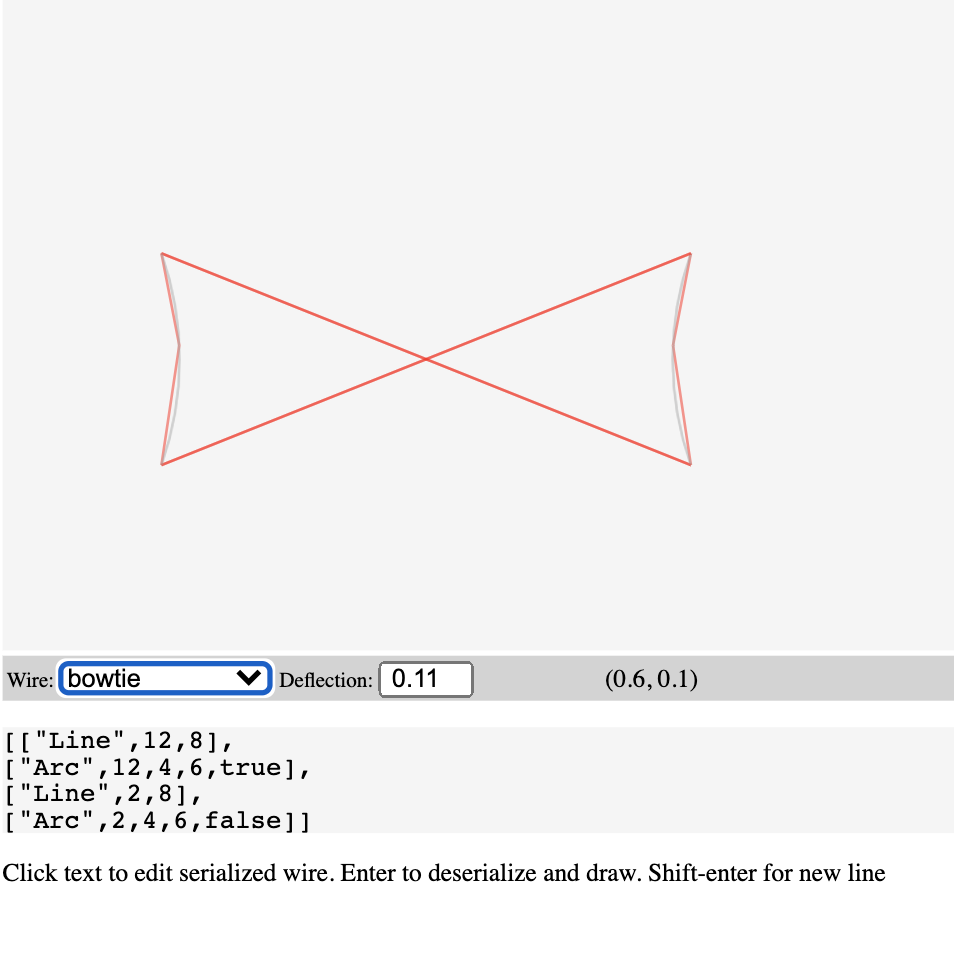

# Computational Geometry Challenge Solution

This challenge is to implement a heavily simplified form of some 2D
boundary-representation geometry data structures and algorithms, as described [here](GeometryTakeHome.md).

The solution has a web UI, found at [svg/render.html](svg/render.html), or at https://optimisticlock.github.io/geometry/svg/render.html 

### Obstacles

* I am not familiar with graphic libraries, so I built a rudimentary SVG-based one. I had to teach myself SVG. And run a refresher on high school trigonometry, which was, alas, completely forgotten in the beginning.

* I tried and rejected due to the complications and the lack of time: Typescript, Node, modules on local web page. 

* I made a mistake of massively overengineering the type hierarchy of Edges. I wanted to make it possible to allow for addition of new future edge types, e.g. an EllipticalArc or BezierCurve. I guess I wanted to use this exercise to experiment and find out to what extent ES6 is suitable for moderately complex OO. Seemed like a good idea at the time, but turned into a showcase on YAGNI, and slowed me down greatly. 

* In hindsight, if I wanted to overengineer, I think it would have been much more useful to focus on making Wires, not Edges, as generic as possible, make it an interface using iterators (ES6 generators would be great for that) and remove the requirement of backing it by an array. The reason for that is, the lower the maximum deflection, the higher the storage requirements for discretized wires, unless they are calculated on the fly. Would have been a much easier change with a greater effect.

* I spent a lot of downtime trying to create the right modular structure instead of polluting the global namespace (`import`/`export`/`require` etc.) Turns out, web browsers aren't very fond of accessing the local file system, because CORS. I even tried to migrate to Typescript, in part because of this issue, and because a strongly typed language is clearly called for. I abandoned both attempts.

* Using Javascript for this has been an interesting experiment, but I wouldn't have done it again.

### Roadmap

##* Detect intersections!!

* I assume input needs to be heavily sanity-checked, given the nature of the business.

* Tests. Including unit tests.

*. Consider turtle graphics. (In fact, I  might have done just that had I understood the assignment correctly in the beginning).
 
* Use `module`/`export`/`import`/`require`

* In a strictly typed language with operator overloading and implicit conversions, like Skala, I'd use Points, not numbers.'That didn't fly so well in Javascript and was one of the things I had to undo.

### Latest screenshot

    
    
